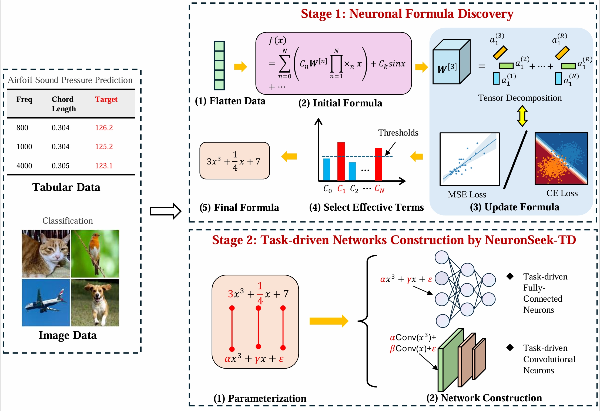

# NeuronSeek: On Stability and Expressivity of Task-driven Neurons


## Overview

**NeuronSeek** is a novel framework for discovering and constructing task-driven neurons that enhance neural network performance through optimized neuronal formulations. Drawing inspiration from the human brain's ability to design specialized neurons for different tasks, this work introduces a tensor decomposition-based approach (NeuronSeek-TD) that offers superior stability and faster convergence compared to traditional symbolic regression methods.

## Key Features

- **Enhanced Stability**: Tensor decomposition (TD) replaces symbolic regression for more stable neuron discovery
- **Theoretical Guarantees**: Mathematical foundations proving universal approximation capabilities
- **Faster Convergence**: Improved optimization dynamics through tensor-based formulations
- **Task-Driven Design**: Neurons specifically optimized for target tasks
- **Competitive Performance**: State-of-the-art results across diverse benchmarks

## Abstract

Drawing inspiration from our human brain that designs different neurons for different tasks, recent advances in deep learning have explored modifying a network's neurons to develop so-called task-driven neurons. Prototyping task-driven neurons (referred to as NeuronSeek) employs symbolic regression (SR) to discover optimal neuron formulations and constructs networks from these optimized neurons. Along this direction, this work replaces symbolic regression with tensor decomposition (TD) to discover optimal neuronal formulations, offering enhanced stability and faster convergence. Furthermore, we establish theoretical guarantees that modifying the aggregation functions with common activation functions can empower a network with a fixed number of parameters to approximate any continuous function with an arbitrarily small error, providing rigorous mathematical foundations for the NeuronSeek framework. Extensive empirical evaluations demonstrate that our NeuronSeek-TD framework not only achieves superior stability, but also is competitive relative to the state-of-the-art models across diverse benchmarks.


## Quick Start

Here's a simple example demonstrating how to use NeuronSeek for regression tasks, you can find tnlearn package [here](https://github.com/NewT123-WM/tnlearn):

```python
from tnlearn import PolynomialTensorRegression
from tnlearn import MLPRegressor
from sklearn.datasets import make_regression
from sklearn.model_selection import train_test_split

# Generate data
X, y = make_regression(n_samples=200, random_state=1)
X_train, X_test, y_train, y_test = train_test_split(X, y, random_state=1)

# Create polynomial tensor regressor to generate task-based neurons
neuron = PolynomialTensorRegression()
neuron.fit(X_train, y_train)

# Build neural network using task-based neurons
clf = MLPRegressor(neurons=neuron.neuron,
                   layers_list=[50, 30, 10])  # Hidden layer structure
clf.fit(X_train, y_train)

# Make predictions
predictions = clf.predict(X_test)
```

## Architecture

The architecture of our proposed framework is shown in figure





## License

This project is licensed under the MIT License - see the [LICENSE](LICENSE) file for details.

## Contact

For questions or issues, please:
- Open an issue on GitHub
- Contact: [peihanyu1122@163.com]

## Citing
If you find this repo useful for your research, please consider citing it:
```
@article{Pei2025,
  author = {Pei, Hanyu and Liao, Jing-Xiao and Zhao, Qibin and Gao, Ting and Zhang, Shijun and Zhang, Xiaoge and Fan, Feng-Lei},
  title = {NeuronSeek: On Stability and Expressivity of Task-Driven Neurons},
  journal = {Preprints},
  year = {2025},
  doi = {10.20944/preprints202506.1586.1},
  url = {https://doi.org/10.20944/preprints202506.1586.1}
}
```

## Acknowledgments

We thank the research community for their valuable feedback and the datasets used in our evaluations.

---

**Keywords**: Deep Learning, Neural Networks, Task-driven Neurons, Tensor Decomposition, Universal Approximation, Machine Learning
